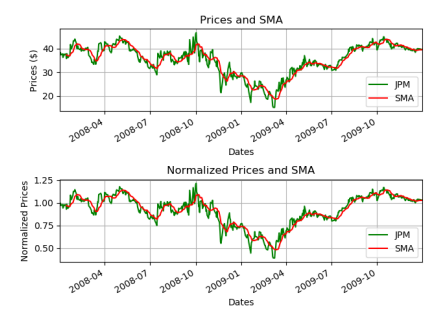
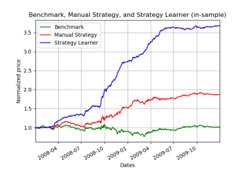
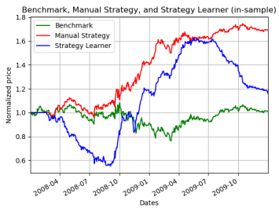
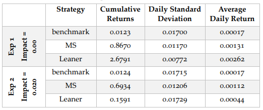

# QLearner Stock Strategy

## Introduction

The objective of the project was to develop a QLearning Machine Learning strategy that would out perform a baseline (buy and hold) strategy and a manual strategy designed from a set of indicators.

## My Implementation
For this project, a single stock (JPM) was chosen between the years 2008 and 2009 to be used in training and testing.

  

The baseline strategy was a simple buy and hold strategy where the stock would be purchased on day 1 and held throughout the entire timeframe. The second strategy was a manual strategy that used a combination of price/SMA, Bollinger Bands, and MACD/divergence to implement buy and sell commands. Finally, the third strategy was a QLearner Machine Learning strategy which used a combination of the above indicators to maximize cumulative returns.

## Results
The first experiment compared the performance on the learner on the in-sample period of 2008-2009 against the Manual Strategy. "in-sample period" means that the 
learner was tested on the same dataset it was trained on. For this experiment, an impact and commission of 0.00 was used for both strategies. Additionally, the learner had an alpha of 0.3, gamma of 0.9, rar of 0.5, radr of 0.99, and a dyna of 1. Lastly, the learner's learning functionality is turned off during the testing period.

 

The experiment showed that on the in-sample period, the learner far out performed the Manual Strategy.

The second experiment ran the same parameters as experiment 1 except with an impace of 0.020. As impact was increased, the performance of the learner decreased.

 

Overall results:
 